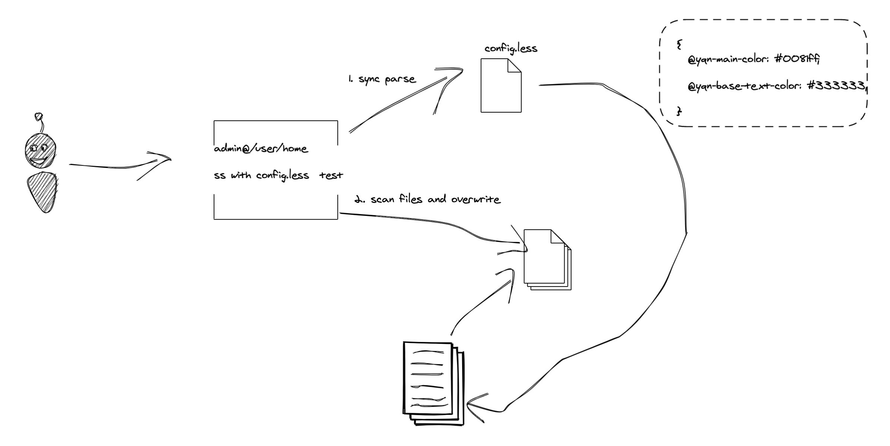

# Super Scan

## 背景

- 项目需要变量化，但是开发的时候，关心变量化可能会降低开发效率；
- 过往未变量化项目需要变量化；

通常的模式都是如下图:


但是：

我们的开发模式：蓝湖 ---> `less`（`copy code` ---> `paste code` ）

拖时间，且变量过多，容易造成烦躁的情绪；

## 处理方案

### 全局搜索替换（开发结束后）

优点：迅速快捷；

缺点：

- 当遇到大面积的色值变量相同时，心智负担较重；（同样需要对比色值变量）

### `IDE`代码片段快捷提示（开发时）

优点：

- 迅速快捷；
- 高效，免去了对比与色值意义记忆；

缺点：

- 违背了大部分场景下的开发模式`CV`;
- 容易漏改，漏替换；
- 效率低；
- 需要定期维护快捷提示文件；
- 跨`IDE`的方案不统一；

### `CLI APP`命令式替换（开发结束后）

优点：

- 定制度高；
- 替换迅速，通常在毫秒级别；
- 范围可控；

缺点：

- 针对复杂色值，像`rgba，#dcdcdcdc，rgb，mix`需要做大量的逻辑处理；
    
## `CLI APP`原理



## `TODOS`

- 针对变量色值重复的，插入相关色值的`TODOS`注释，并且展示结果；
- `rgba`、`rgb`、`#dcdcdcdc`、`mix`暂未做规则替换处理；
- 特殊规则可以考虑用 `less AST`做植入覆写；

## 知识点

- `Node`核心模块的常用`API`: `fs`、`path`、`process`;
- `package.json`；
   - [package.json 指南（Node官网）](http://nodejs.cn/learn/the-package-json-guide)
   - [package.json --- alpha标准参考](https://javascript.ruanyifeng.com/nodejs/packagejson.html)
- [`scripts`与`bin`的联系](https://javascript.ruanyifeng.com/nodejs/packagejson.html#toc4)

## 犯错记录

~~尝试使用子进程充分利用多核去处理I/O递归替换，但是忽略了Node底层已经分配了最小四个线程去处理I/O，通过对比，发现时间线严重拉低。~~

~~每次创建与销毁子进程都会造成额外的开销，且很大~~


## 收获

- 进程之间的消息传递会被序列化，所以像函数是无法被消息传递的。
- 子进程在执行完毕后，一定要及时杀掉，不然~~MEM会迅速飙升，mac重启11次的血泪教训~~，可以尝试设置进程守护，超出指定内存后自动自杀，防止系统或者其他程序崩溃。

```js

// 当进程出现会崩溃的错误 子进程捕获uncautht异常，并主动退出；
process.on('uncaughtException', function (err) {
    // 这里可以做写日志的操作
    console.log(err);
    // 退出进程
    process.exit();
});

// 内存使用过多，自杀 子进程监控内存占用过大，主动退出；
if (process.memoryUsage().rss > 734003200) {
    process.exit();
}
```


## 参考文档

【1】[Commander.js](https://github.com/tj/commander.js/blob/HEAD/Readme_zh-CN.md)

【2】[从 1 到完美，用 node 写一个命令行工具](https://segmentfault.com/a/1190000016555129)

【3】[Node.js CLI Apps Best Practices](https://github.com/lirantal/nodejs-cli-apps-best-practices/tree/3afe1ab0a5b506ef8c32903c4bf253a4cdb4bddd)

【4】[Node.js v15.12.0文档](https://nodejs.org/api/fs.html)

【5】[nodejs真的是单线程吗？](https://segmentfault.com/a/1190000014926921)

【6】[什么是cpu密集型，io密集型](https://zhuanlan.zhihu.com/p/62766037)

【7】[多进程优化：Node.js子进程与线程](https://serverless-action.com/fontend/nodejs/%E5%A4%9A%E8%BF%9B%E7%A8%8B%E4%BC%98%E5%8C%96%EF%BC%9ANode.js%E5%AD%90%E8%BF%9B%E7%A8%8B%E4%B8%8E%E7%BA%BF%E7%A8%8B.html#%E8%BF%9B%E7%A8%8B%E5%92%8C%E7%BA%BF%E7%A8%8B%E5%9F%BA%E6%9C%AC%E6%A6%82%E5%BF%B5)

【8】[浏览器与Node的事件循环(Event Loop)有何区别?](https://blog.fundebug.com/2019/01/15/diffrences-of-browser-and-node-in-event-loop/)